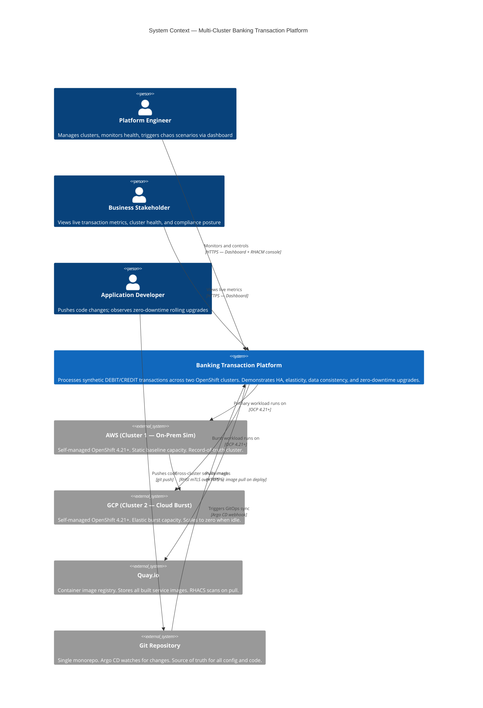
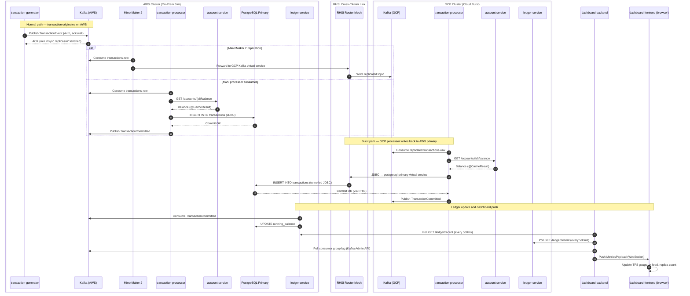
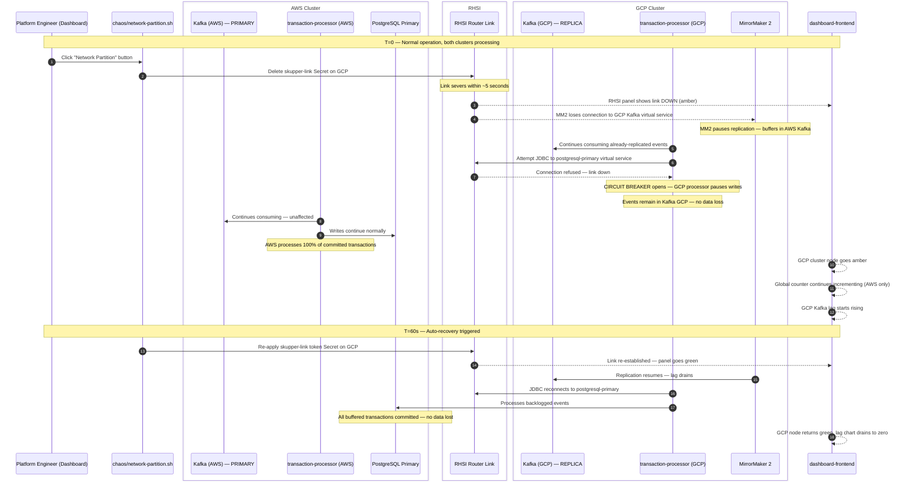

# Multi-Cluster Banking Transaction Platform
## C4 Architecture Diagrams
### Red Hat OpenShift — AWS (on-prem sim) + GCP (cloud burst)

---

## Diagram 1: C4 Level 1 — System Context

Shows who uses the system and what external systems it touches.



---

## Diagram 2: C4 Level 2 — Container Diagram

Shows all running services, infrastructure components, and how they communicate.

```mermaid
C4Container
  title Container Diagram — Multi-Cluster Banking Transaction Platform

  Person(ops, "Platform / Ops Engineer", "")
  Person(user, "Exec / Developer", "")

  Boundary(aws_cluster, "Cluster 1 — AWS  |  OpenShift 4.21+  |  Namespace: banking-demo / banking-infra") {

    Container(gen_aws, "transaction-generator", "Quarkus 3 / JVM", "Emits synthetic DEBIT/CREDIT TransactionEvents to Kafka at configurable TPS")
    Container(proc_aws, "transaction-processor", "Quarkus 3 Native + KEDA", "Consumes Kafka events, validates balance, writes to PostgreSQL, emits TransactionCommitted")
    Container(acct_aws, "account-service", "Quarkus 3 REST", "Account balance reads via @CacheResult in-process cache. Reads PostgreSQL directly.")
    Container(ledger_aws, "ledger-service", "Quarkus 3 REST", "Authoritative running balance. Serves REST to dashboard-backend.")
    Container(gateway, "cluster-gateway", "Quarkus 3 REST", "Traffic weight control. Aggregated /health and /metrics endpoint.")
    Container(dash_be, "dashboard-backend", "Quarkus 3 WebSocket", "Polls both clusters every 500ms. Aggregates and streams MetricsPayload.")
    Container(dash_fe, "dashboard-frontend", "React 18 + Patternfly 5", "Live dashboard: cluster map, TPS gauges, chaos panel, compliance widget.")

    ContainerDb(kafka_aws, "Streams for Apache Kafka", "Kafka 3 — 3 brokers", "Topics: transactions-raw, transactions-committed, transactions-dlq")
    ContainerDb(pg_aws, "PostgreSQL Primary", "Crunchy Postgres for Kubernetes v5", "Accounts + transactions tables. EBS-backed PVC. PgBouncer pooling.")
    Container(mm2, "MirrorMaker 2", "Streams for Apache Kafka", "Replicates transactions-raw AWS → GCP via RHSI virtual service")
    Container(apicurio, "Apicurio Registry", "Apicurio 2.x", "Avro schema registry. Enforces backward compatibility.")
    Container(skupper_aws, "RHSI Router", "Red Hat Service Interconnect 2", "L7 AMQP router. Issues link token. Exposes kafka-bootstrap, postgresql-primary as virtual services.")
    Container(rhacm, "RHACM Hub", "RHACM 2.12+", "Manages both clusters. Placement policies. Observability federation. Governance.")
    Container(argocd, "Argo CD", "OpenShift GitOps 1.13+", "ApplicationSets deploy all services to both clusters via Kustomize overlays.")
    Container(ossm_aws, "Service Mesh CP", "OpenShift Service Mesh 2 (Istio)", "mTLS, traffic splitting, circuit breaker, VirtualService for AWS workloads.")
  }

  Boundary(gcp_cluster, "Cluster 2 — GCP  |  OpenShift 4.21+  |  Namespace: banking-demo / banking-infra") {

    Container(gen_gcp, "transaction-generator", "Quarkus 3 / JVM", "Emits events to local Kafka replica. TPS split configurable via ConfigMap.")
    Container(proc_gcp, "transaction-processor", "Quarkus 3 Native + KEDA", "Consumes local Kafka replica. Writes to AWS PostgreSQL via RHSI. Scales 0–20.")
    Container(acct_gcp, "account-service", "Quarkus 3 REST", "@CacheResult in-process cache. 0–5 replicas via HPA.")
    Container(ledger_gcp, "ledger-service", "Quarkus 3 REST", "Read-only from PostgreSQL standby. Serves GCP-local latency reads.")

    ContainerDb(kafka_gcp, "Streams for Apache Kafka", "Kafka 3 — 3 brokers", "Receives replicated topics from AWS via MirrorMaker 2.")
    ContainerDb(pg_gcp, "PostgreSQL Standby", "Crunchy Postgres for Kubernetes v5", "Streaming replica from AWS primary. Read-only. PD-backed PVC.")
    Container(skupper_gcp, "RHSI Router", "Red Hat Service Interconnect 2", "Consumes link token from AWS. Provides virtual services: kafka-bootstrap, postgresql-primary.")
    Container(ossm_gcp, "Service Mesh CP", "OpenShift Service Mesh 2 (Istio)", "mTLS, traffic splitting, circuit breaker for GCP workloads.")
    Container(keda_gcp, "Custom Metrics Autoscaler", "CMA v2.18 (KEDA 2.x)", "Scales transaction-processor on Kafka consumer group lag. 0→20 replicas.")
  }

  Boundary(shared_infra, "Shared External Services") {
    System_Ext(quay, "Quay.io", "Image registry — both clusters pull from here")
    System_Ext(git, "Git Repository", "Argo CD source of truth")
  }

  Rel(user, dash_fe, "Views live metrics", "HTTPS")
  Rel(ops, dash_fe, "Operates chaos panel", "HTTPS")
  Rel(ops, rhacm, "Manages clusters", "HTTPS — RHACM console")
  Rel(dash_fe, dash_be, "WebSocket stream", "WSS /ws/metrics")
  Rel(dash_be, ledger_aws, "Polls ledger", "HTTP REST")
  Rel(dash_be, ledger_gcp, "Polls ledger", "HTTP REST via RHSI")
  Rel(dash_be, gateway, "Polls health + metrics", "HTTP REST")

  Rel(gen_aws, kafka_aws, "Publishes TransactionEvent", "Kafka producer / Avro")
  Rel(gen_gcp, kafka_gcp, "Publishes TransactionEvent", "Kafka producer / Avro")
  Rel(proc_aws, kafka_aws, "Consumes transactions-raw", "Kafka consumer group")
  Rel(proc_gcp, kafka_gcp, "Consumes replicated transactions-raw", "Kafka consumer group")
  Rel(proc_aws, acct_aws, "Balance check", "HTTP REST")
  Rel(proc_gcp, acct_gcp, "Balance check", "HTTP REST")
  Rel(proc_aws, pg_aws, "Writes committed tx", "JDBC / PgBouncer")
  Rel(proc_gcp, pg_aws, "Writes committed tx via RHSI", "JDBC → RHSI → AWS primary")
  Rel(proc_aws, kafka_aws, "Publishes TransactionCommitted", "Kafka producer / Avro")
  Rel(proc_gcp, kafka_gcp, "Publishes TransactionCommitted", "Kafka producer / Avro")


  Rel(ledger_aws, pg_aws, "Reads ledger", "JDBC")
  Rel(ledger_gcp, pg_gcp, "Reads from standby", "JDBC")

  Rel(mm2, kafka_aws, "Reads source topics", "Kafka consumer")
  Rel(mm2, kafka_gcp, "Writes replicated topics", "Kafka producer via RHSI")

  Rel(skupper_aws, skupper_gcp, "mTLS router link", "HTTPS — AMQP over TLS")

  Rel(argocd, git, "Watches for changes", "git poll / webhook")
  Rel(argocd, aws_cluster, "Deploys via Kustomize", "kubectl apply")
  Rel(argocd, gcp_cluster, "Deploys via Kustomize", "kubectl apply")

  Rel(gen_aws, apicurio, "Fetches Avro schema", "HTTPS")
  Rel(gen_gcp, apicurio, "Fetches Avro schema", "HTTPS via RHSI")
  Rel(proc_aws, apicurio, "Fetches Avro schema", "HTTPS")

  UpdateLayoutConfig($c4ShapeInRow="4", $c4BoundaryInRow="1")
```

---

## Diagram 3: C4 Level 3 — Deployment Diagram

Shows how containers map to physical/cloud infrastructure, storage, and network layers.

```mermaid
C4Deployment
  title Deployment Diagram — Multi-Cluster Banking Transaction Platform

  Deployment_Node(aws_cloud, "Amazon Web Services", "us-east-1 (or preferred region)") {

    Deployment_Node(aws_ocp, "OpenShift 4.21+ Self-Managed", "3× control plane EC2  |  3–6× worker EC2  |  Default storage class: AWS EBS (gp2/gp3)") {

      Deployment_Node(ns_infra_aws, "Namespace: banking-infra") {
        Container(kafka_aws_d, "Streams for Apache Kafka", "3 Kafka broker pods  |  3 ZooKeeper pods  |  PVC: EBS default SC")
        Container(mm2_d, "MirrorMaker 2", "1–2 pods  |  Replicates to GCP via RHSI")
        Container(pg_aws_d, "PostgreSQL Primary", "3-node HA  |  PgBouncer sidecar  |  PVC: EBS default SC")
        Container(apicurio_d, "Apicurio Registry", "2 pods  |  PostgreSQL-backed")
        Container(skupper_aws_d, "RHSI Router", "1 pod  |  Exposes 2 virtual services  |  Route: skupper.apps.<aws-domain>")
      }

      Deployment_Node(ns_demo_aws, "Namespace: banking-demo") {
        Container(gen_aws_d, "transaction-generator", "1 pod  |  ConfigMap: TPS=200")
        Container(proc_aws_d, "transaction-processor", "1–10 pods  |  KEDA: lag threshold 100")
        Container(acct_aws_d, "account-service", "2 pods  |  HPA: CPU 60%")
        Container(ledger_aws_d, "ledger-service", "2 pods")
        Container(gateway_d, "cluster-gateway", "2 pods  |  Manages Istio VS weights")
        Container(dash_be_d, "dashboard-backend", "2 pods  |  WebSocket /ws/metrics")
        Container(dash_fe_d, "dashboard-frontend", "2 pods  |  Route: dashboard.apps.<aws-domain>  |  TLS via cert-manager")
      }

      Deployment_Node(ns_platform_aws, "Platform Namespaces") {
        Container(rhacm_d, "RHACM Hub", "open-cluster-management NS  |  MultiClusterHub CR")
        Container(argocd_d, "Argo CD", "openshift-gitops NS  |  ApplicationSets for both clusters")
        Container(ossm_aws_d, "OSSM Control Plane", "istio-system NS  |  SMCP + SMMR")
        Container(keda_aws_d, "Custom Metrics Autoscaler", "openshift-keda NS  |  ScaledObjects for transaction-processor")
        Container(rhacs_d, "RHACS Central", "stackrox NS  |  Policy engine + pipeline gate")
        Container(monitoring_aws, "Observability Stack", "banking-monitoring NS  |  Grafana + Jaeger + Prometheus rules")
      }
    }
  }

  Deployment_Node(gcp_cloud, "Google Cloud Platform", "us-central1 (or preferred region)") {

    Deployment_Node(gcp_ocp, "OpenShift 4.21+ Self-Managed", "3× control plane GCE  |  0–8× worker GCE (elastic)  |  Default storage class: GCP PD (standard/ssd)") {

      Deployment_Node(ns_infra_gcp, "Namespace: banking-infra") {
        Container(kafka_gcp_d, "Streams for Apache Kafka — Replica", "3 Kafka broker pods  |  PVC: GCP PD default SC  |  Receives MM2 replication from AWS")
        Container(pg_gcp_d, "PostgreSQL Standby", "1 standby pod  |  PgBouncer sidecar  |  PVC: GCP PD default SC  |  Streaming replica from AWS primary")
        Container(skupper_gcp_d, "RHSI Router", "1 pod  |  Consumes link token from AWS  |  Tunnels to AWS: kafka:9092, pg:5432")
      }

      Deployment_Node(ns_demo_gcp, "Namespace: banking-demo") {
        Container(gen_gcp_d, "transaction-generator", "1 pod  |  ConfigMap: TPS=200 (split with AWS)")
        Container(proc_gcp_d, "transaction-processor", "0–20 pods  |  KEDA: scales on Kafka consumer lag  |  Writes to AWS PostgreSQL via RHSI")
        Container(acct_gcp_d, "account-service", "0–5 pods  |  HPA: CPU 60%")
        Container(ledger_gcp_d, "ledger-service", "1 pod  |  Read-only from local PostgreSQL standby")
      }

      Deployment_Node(ns_platform_gcp, "Platform Namespaces") {
        Container(ossm_gcp_d, "OSSM Control Plane", "istio-system NS  |  SMCP + SMMR")
        Container(keda_gcp_d, "Custom Metrics Autoscaler", "openshift-keda NS  |  ScaledObjects: proc 0→20 on lag")
        Container(rhacs_sensor, "RHACS Sensor", "stackrox NS  |  Reports to AWS RHACS Central")
        Container(monitoring_gcp, "Observability Stack", "banking-monitoring NS  |  Jaeger + Prometheus  |  Federated to AWS Grafana via RHACM")
      }
    }
  }

  Deployment_Node(external, "External Services") {
    Container(quay_d, "Quay.io", "Image registry  |  Both clusters pull on deploy  |  RHACS scans on image push")
    Container(git_d, "Git Repository", "Argo CD source of truth  |  Webhook triggers sync on push")
  }

  Rel(skupper_aws_d, skupper_gcp_d, "mTLS router link  |  AMQP over HTTPS", "Public LB endpoints")
  Rel(mm2_d, kafka_gcp_d, "Replicates topics", "Via RHSI virtual service → kafka-bootstrap GCP")
  Rel(proc_gcp_d, pg_aws_d, "Writes committed transactions", "JDBC → RHSI → AWS PgBouncer → PostgreSQL primary")
  Rel(rhacm_d, gcp_ocp, "Manages spoke cluster", "HTTPS — klusterlet")
  Rel(argocd_d, ns_demo_aws, "Deploys onprem overlay", "kubectl — Kustomize")
  Rel(argocd_d, ns_demo_gcp, "Deploys cloud overlay", "kubectl — Kustomize")
  Rel(argocd_d, git_d, "Watches repo", "git poll / webhook")
  Rel(aws_ocp, quay_d, "Pulls images", "HTTPS")
  Rel(gcp_ocp, quay_d, "Pulls images", "HTTPS")
  Rel(rhacs_sensor, rhacs_d, "Reports policy status", "gRPC mTLS")
  Rel(monitoring_gcp, monitoring_aws, "Federated metrics", "RHACM Observability Add-on")
```

---

## Diagram 4: Transaction Flow — Sequence Diagram

Shows the exact path of a single transaction from generation to dashboard, including the cross-cluster write path.



---

## Diagram 5: Chaos Scenario — RHSI Link Partition

Shows exactly what happens to the data flow when the cross-cluster link is severed.



---

## Notes for Claude Code

### Rendering
- All diagrams are valid Mermaid syntax (v10+)
- Render to PNG using: `mmdc -i architecture-diagrams.md -o docs/architecture/ --theme neutral`
- Or split into individual files and render each separately
- C4 diagrams require Mermaid v10.3+ for `C4Context`, `C4Container`, `C4Deployment` support

### Files to generate in docs/architecture/
```
docs/architecture/
├── architecture-diagrams.md          # This file (Mermaid source)
├── c4-context.png                    # Rendered from Diagram 1
├── c4-container.png                  # Rendered from Diagram 2
├── c4-deployment.png                 # Rendered from Diagram 3
├── sequence-transaction-flow.png     # Rendered from Diagram 4
└── sequence-chaos-partition.png      # Rendered from Diagram 5
```

### Storage Class Note (updated)
Both clusters use the **default storage class** of their respective OCP installation.
No storage class names are pinned in manifests. This ensures portability across
any OCP deployment. Crunchy Postgres for Kubernetes and Streams for Apache Kafka PVCs will use whatever
default SC is configured on the cluster at deploy time.

### Self-Managed OCP Note
Neither cluster uses a managed service (no ROSA, no OSD).
Both are self-managed OpenShift 4.21+ installs on EC2 (AWS) and GCE (GCP).
The bootstrap script must handle full OCP install prerequisites including
pull-secret configuration and DNS setup for *.apps.<cluster-domain>.
