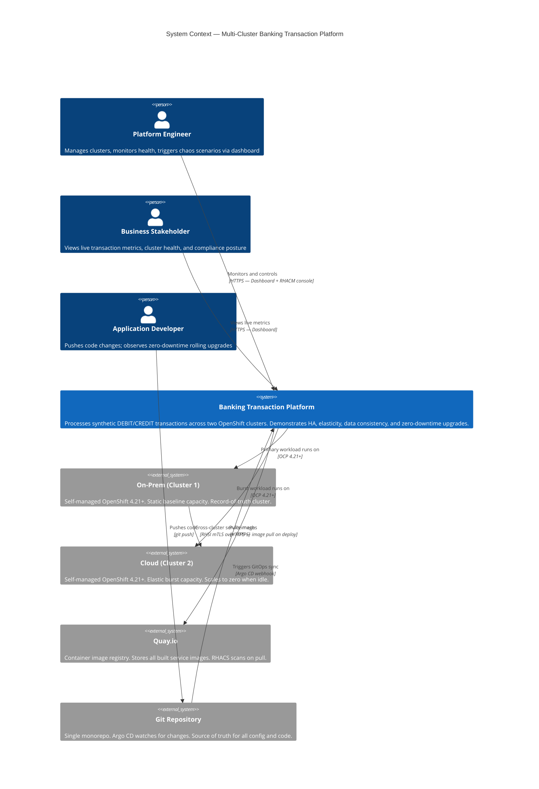
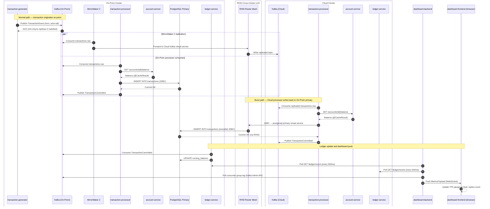
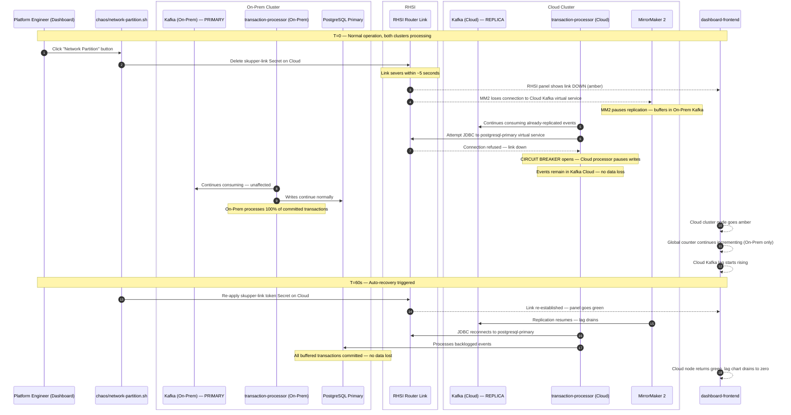

# Multi-Cluster Banking Transaction Platform
## C4 Architecture Diagrams
### Red Hat OpenShift — On-Prem + Cloud

---

## Diagram 1: C4 Level 1 — System Context

Shows who uses the system and what external systems it touches.


```mermaid
C4Context
  title System Context — Multi-Cluster Banking Transaction Platform

  Person(ops, "Platform Engineer", "Manages clusters, monitors health, triggers chaos scenarios via dashboard")
  Person(exec, "Business Stakeholder", "Views live transaction metrics, cluster health, and compliance posture")
  Person(dev, "Application Developer", "Pushes code changes; observes zero-downtime rolling upgrades")

  System(platform, "Banking Transaction Platform", "Processes synthetic DEBIT/CREDIT transactions across two OpenShift clusters. Demonstrates HA, elasticity, data consistency, and zero-downtime upgrades.")

  System_Ext(onprem, "On-Prem (Cluster 1)", "Self-managed OpenShift 4.21+. Static baseline capacity. Record-of-truth cluster.")
  System_Ext(cloud, "Cloud (Cluster 2)", "Self-managed OpenShift 4.21+. Elastic burst capacity. Scales to zero when idle.")
  System_Ext(quay, "Quay.io", "Container image registry. Stores all built service images. RHACS scans on pull.")
  System_Ext(git, "Git Repository", "Single monorepo. Argo CD watches for changes. Source of truth for all config and code.")

  Rel(ops, platform, "Monitors and controls", "HTTPS — Dashboard + RHACM console")
  Rel(exec, platform, "Views live metrics", "HTTPS — Dashboard")
  Rel(dev, git, "Pushes code", "git push")
  Rel(git, platform, "Triggers GitOps sync", "Argo CD webhook")
  Rel(platform, quay, "Pulls images", "HTTPS — image pull on deploy")
  Rel(platform, onprem, "Primary workload runs on", "OCP 4.21+")
  Rel(platform, cloud, "Burst workload runs on", "OCP 4.21+")
  Rel(onprem, cloud, "Cross-cluster service mesh", "RHSI mTLS over HTTPS")

  UpdateLayoutConfig($c4ShapeInRow="3", $c4BoundaryInRow="1")
```

---

## Diagram 2: C4 Level 2 — Container Diagram

Shows all running services, infrastructure components, and how they communicate.

```mermaid
C4Container
  title Container Diagram — Multi-Cluster Banking Transaction Platform

  Person(ops, "Platform / Ops Engineer", "")
  Person(user, "Exec / Developer", "")

  Boundary(onprem_cluster, "Cluster 1 — On-Prem  |  OpenShift 4.21+  |  Namespace: banking-demo / banking-infra") {

    Container(gen_onprem, "transaction-generator", "Quarkus 3 / JVM", "Emits synthetic DEBIT/CREDIT TransactionEvents to Kafka at configurable TPS")
    Container(proc_onprem, "transaction-processor", "Quarkus 3 Native + KEDA", "Consumes Kafka events, validates balance, writes to PostgreSQL, emits TransactionCommitted")
    Container(acct_onprem, "account-service", "Quarkus 3 REST", "Account balance reads via @CacheResult in-process cache. Reads PostgreSQL directly.")
    Container(ledger_onprem, "ledger-service", "Quarkus 3 REST", "Authoritative running balance. Serves REST to dashboard-backend.")
    Container(gateway, "cluster-gateway", "Quarkus 3 REST", "Traffic weight control. Aggregated /health and /metrics endpoint.")
    Container(dash_be, "dashboard-backend", "Quarkus 3 WebSocket", "Polls both clusters every 500ms. Aggregates and streams MetricsPayload.")
    Container(dash_fe, "dashboard-frontend", "React 18 + Patternfly 5", "Live dashboard: cluster map, TPS gauges, chaos panel, compliance widget.")

    ContainerDb(kafka_onprem, "Streams for Apache Kafka", "Kafka 4.2.0 — KRaft mode (3 controllers + 3 brokers)", "Topics: transactions-raw, transactions-committed, transactions-dlq")
    ContainerDb(pg_onprem, "PostgreSQL Primary", "Crunchy Postgres for Kubernetes v5", "Accounts + transactions tables. Default-storage-class PVC. PgBouncer pooling.")
    Container(mm2, "MirrorMaker 2", "Streams for Apache Kafka", "Replicates transactions-raw On-Prem → Cloud via RHSI virtual service")
    Container(apicurio, "Apicurio Registry", "Apicurio 2.x", "Avro schema registry. Enforces backward compatibility.")
    Container(skupper_onprem, "RHSI Router", "Red Hat Service Interconnect 2", "L7 AMQP router. Issues link token. Exposes kafka-bootstrap, postgresql-primary as virtual services.")
    Container(rhacm, "RHACM Hub", "RHACM 2.16+", "Manages both clusters. Placement policies. Observability federation. Governance.")
    Container(argocd, "Argo CD", "OpenShift GitOps 1.13+", "ApplicationSets deploy all services to both clusters via Kustomize overlays.")
    Container(ossm_onprem, "Service Mesh CP", "OpenShift Service Mesh 2 (Istio)", "mTLS, traffic splitting, circuit breaker, VirtualService for On-Prem workloads.")
  }

  Boundary(cloud_cluster, "Cluster 2 — Cloud  |  OpenShift 4.21+  |  Namespace: banking-demo / banking-infra") {

    Container(gen_cloud, "transaction-generator", "Quarkus 3 / JVM", "Emits events to local Kafka replica. TPS split configurable via ConfigMap.")
    Container(proc_cloud, "transaction-processor", "Quarkus 3 Native + KEDA", "Consumes local Kafka replica. Writes to On-Prem PostgreSQL via RHSI. Scales 1–20.")
    Container(acct_cloud, "account-service", "Quarkus 3 REST", "@CacheResult in-process cache. 1–20 replicas via HPA.")
    Container(ledger_cloud, "ledger-service", "Quarkus 3 REST", "Read-only from PostgreSQL standby. Serves Cloud-local latency reads.")

    ContainerDb(kafka_cloud, "Streams for Apache Kafka", "Kafka 4.2.0 — KRaft mode (3 controllers + 3 brokers)", "Receives replicated topics from On-Prem via MirrorMaker 2.")
    ContainerDb(pg_cloud, "PostgreSQL Standby", "Crunchy Postgres for Kubernetes v5", "Streaming replica from On-Prem primary. Read-only. Default-storage-class PVC.")
    Container(skupper_cloud, "RHSI Router", "Red Hat Service Interconnect 2", "Consumes link token from On-Prem. Provides virtual services: kafka-bootstrap, postgresql-primary.")
    Container(ossm_cloud, "Service Mesh CP", "OpenShift Service Mesh 2 (Istio)", "mTLS, traffic splitting, circuit breaker for Cloud workloads.")
    Container(keda_cloud, "Custom Metrics Autoscaler", "CMA v2.18 (KEDA 2.x)", "Scales transaction-processor on Kafka consumer group lag. 1→20 replicas.")
  }

  Boundary(shared_infra, "Shared External Services") {
    System_Ext(quay, "Quay.io", "Image registry — both clusters pull from here")
    System_Ext(git, "Git Repository", "Argo CD source of truth")
  }

  Rel(user, dash_fe, "Views live metrics", "HTTPS")
  Rel(ops, dash_fe, "Operates chaos panel", "HTTPS")
  Rel(ops, rhacm, "Manages clusters", "HTTPS — RHACM console")
  Rel(dash_fe, dash_be, "WebSocket stream", "WSS /ws/metrics")
  Rel(dash_be, ledger_onprem, "Polls ledger", "HTTP REST")
  Rel(dash_be, ledger_cloud, "Polls ledger", "HTTP REST via RHSI")
  Rel(dash_be, gateway, "Polls health + metrics", "HTTP REST")

  Rel(gen_onprem, kafka_onprem, "Publishes TransactionEvent", "Kafka producer / Avro")
  Rel(gen_cloud, kafka_cloud, "Publishes TransactionEvent", "Kafka producer / Avro")
  Rel(proc_onprem, kafka_onprem, "Consumes transactions-raw", "Kafka consumer group")
  Rel(proc_cloud, kafka_cloud, "Consumes replicated transactions-raw", "Kafka consumer group")
  Rel(proc_onprem, acct_onprem, "Balance check", "HTTP REST")
  Rel(proc_cloud, acct_cloud, "Balance check", "HTTP REST")
  Rel(proc_onprem, pg_onprem, "Writes committed tx", "JDBC / PgBouncer")
  Rel(proc_cloud, pg_onprem, "Writes committed tx via RHSI", "JDBC → RHSI → On-Prem primary")
  Rel(proc_onprem, kafka_onprem, "Publishes TransactionCommitted", "Kafka producer / Avro")
  Rel(proc_cloud, kafka_cloud, "Publishes TransactionCommitted", "Kafka producer / Avro")


  Rel(ledger_onprem, pg_onprem, "Reads ledger", "JDBC")
  Rel(ledger_cloud, pg_cloud, "Reads from standby", "JDBC")

  Rel(mm2, kafka_onprem, "Reads source topics", "Kafka consumer")
  Rel(mm2, kafka_cloud, "Writes replicated topics", "Kafka producer via RHSI")

  Rel(skupper_onprem, skupper_cloud, "mTLS router link", "HTTPS — AMQP over TLS")

  Rel(argocd, git, "Watches for changes", "git poll / webhook")
  Rel(argocd, onprem_cluster, "Deploys via Kustomize", "oc apply")
  Rel(argocd, cloud_cluster, "Deploys via Kustomize", "oc apply")

  Rel(gen_onprem, apicurio, "Fetches Avro schema", "HTTPS")
  Rel(gen_cloud, apicurio, "Fetches Avro schema", "HTTPS via RHSI")
  Rel(proc_onprem, apicurio, "Fetches Avro schema", "HTTPS")

  UpdateLayoutConfig($c4ShapeInRow="4", $c4BoundaryInRow="1")
```

---

## Diagram 3: C4 Level 3 — Deployment Diagram

Shows how containers map to physical/cloud infrastructure, storage, and network layers.

```mermaid
C4Deployment
  title Deployment Diagram — Multi-Cluster Banking Transaction Platform

  Deployment_Node(onprem_infra, "On-Prem Provider", "region-specific — whatever the underlying provider offers for this run") {

    Deployment_Node(onprem_ocp, "OpenShift 4.21+ Self-Managed", "3× control plane nodes  |  3–6× worker nodes  |  Default storage class of the provider") {

      Deployment_Node(ns_infra_onprem, "Namespace: banking-infra") {
        Container(kafka_onprem_d, "Streams for Apache Kafka", "KRaft mode  |  3 controller pods (5Gi PVC)  |  3 broker pods (20Gi PVC)  |  Default storage class")
        Container(mm2_d, "MirrorMaker 2", "1–2 pods  |  Replicates to Cloud via RHSI")
        Container(pg_onprem_d, "PostgreSQL Primary", "3-node HA  |  PgBouncer sidecar  |  PVC: default storage class")
        Container(apicurio_d, "Apicurio Registry", "1 pod  |  kafkasql-backed (2.5.11.Final)")
        Container(skupper_onprem_d, "RHSI Router", "1 pod  |  Exposes 2 virtual services  |  Route: skupper.apps.<onprem-domain>")
      }

      Deployment_Node(ns_demo_onprem, "Namespace: banking-demo") {
        Container(gen_onprem_d, "transaction-generator", "1 pod  |  ConfigMap: TPS=200")
        Container(proc_onprem_d, "transaction-processor", "1–20 pods  |  KEDA: lag threshold 100")
        Container(acct_onprem_d, "account-service", "1–20 pods  |  HPA: CPU 60%")
        Container(ledger_onprem_d, "ledger-service", "2 pods")
        Container(gateway_d, "cluster-gateway", "2 pods  |  Manages Istio VS weights")
        Container(dash_be_d, "dashboard-backend", "2 pods  |  WebSocket /ws/metrics")
        Container(dash_fe_d, "dashboard-frontend", "2 pods  |  Route: dashboard.apps.<onprem-domain>  |  TLS via cert-manager")
      }

      Deployment_Node(ns_platform_onprem, "Platform Namespaces") {
        Container(rhacm_d, "RHACM Hub", "open-cluster-management NS  |  MultiClusterHub CR")
        Container(argocd_d, "Argo CD", "openshift-gitops NS  |  ApplicationSets for both clusters")
        Container(ossm_onprem_d, "OSSM Control Plane", "istio-system NS  |  SMCP + SMMR")
        Container(keda_onprem_d, "Custom Metrics Autoscaler", "openshift-keda NS  |  ScaledObjects for transaction-processor")
        Container(rhacs_d, "RHACS Central", "stackrox NS  |  Policy engine + pipeline gate")
        Container(monitoring_onprem, "Observability Stack", "banking-monitoring NS  |  Grafana + Jaeger + Prometheus rules")
      }
    }
  }

  Deployment_Node(cloud_infra, "Cloud Provider", "region-specific — whatever the underlying provider offers for this run") {

    Deployment_Node(cloud_ocp, "OpenShift 4.21+ Self-Managed", "3× control plane nodes  |  0–8× worker nodes (elastic)  |  Default storage class of the provider") {

      Deployment_Node(ns_infra_cloud, "Namespace: banking-infra") {
        Container(kafka_cloud_d, "Streams for Apache Kafka — Replica", "KRaft mode  |  3 controller pods (5Gi PVC)  |  3 broker pods (20Gi PVC)  |  Default storage class  |  Receives MM2 replication from On-Prem")
        Container(pg_cloud_d, "PostgreSQL Standby", "1 standby pod  |  PgBouncer sidecar  |  PVC: default storage class  |  Streaming replica from On-Prem primary")
        Container(skupper_cloud_d, "RHSI Router", "1 pod  |  Consumes link token from On-Prem  |  Tunnels to On-Prem: kafka:9092, pg:5432")
      }

      Deployment_Node(ns_demo_cloud, "Namespace: banking-demo") {
        Container(gen_cloud_d, "transaction-generator", "1 pod  |  ConfigMap: TPS=200 (split with On-Prem)")
        Container(proc_cloud_d, "transaction-processor", "1–20 pods  |  KEDA: scales on Kafka consumer lag  |  Writes to On-Prem PostgreSQL via RHSI")
        Container(acct_cloud_d, "account-service", "1–20 pods  |  HPA: CPU 60%")
        Container(ledger_cloud_d, "ledger-service", "1 pod  |  Read-only from local PostgreSQL standby")
      }

      Deployment_Node(ns_platform_cloud, "Platform Namespaces") {
        Container(ossm_cloud_d, "OSSM Control Plane", "istio-system NS  |  SMCP + SMMR")
        Container(keda_cloud_d, "Custom Metrics Autoscaler", "openshift-keda NS  |  ScaledObjects: proc 1→20 on lag")
        Container(rhacs_sensor, "RHACS Sensor", "stackrox NS  |  Reports to On-Prem RHACS Central")
        Container(monitoring_cloud, "Observability Stack", "banking-monitoring NS  |  Jaeger + Prometheus  |  Federated to On-Prem Grafana via RHACM")
      }
    }
  }

  Deployment_Node(external, "External Services") {
    Container(quay_d, "Quay.io", "Image registry  |  Both clusters pull on deploy  |  RHACS scans on image push")
    Container(git_d, "Git Repository", "Argo CD source of truth  |  Webhook triggers sync on push")
  }

  Rel(skupper_onprem_d, skupper_cloud_d, "mTLS router link  |  AMQP over HTTPS", "Public LB endpoints")
  Rel(mm2_d, kafka_cloud_d, "Replicates topics", "Via RHSI virtual service → kafka-bootstrap Cloud")
  Rel(proc_cloud_d, pg_onprem_d, "Writes committed transactions", "JDBC → RHSI → On-Prem PgBouncer → PostgreSQL primary")
  Rel(rhacm_d, cloud_ocp, "Manages spoke cluster", "HTTPS — klusterlet")
  Rel(argocd_d, ns_demo_onprem, "Deploys onprem overlay", "oc — Kustomize")
  Rel(argocd_d, ns_demo_cloud, "Deploys cloud overlay", "oc — Kustomize")
  Rel(argocd_d, git_d, "Watches repo", "git poll / webhook")
  Rel(onprem_ocp, quay_d, "Pulls images", "HTTPS")
  Rel(cloud_ocp, quay_d, "Pulls images", "HTTPS")
  Rel(rhacs_sensor, rhacs_d, "Reports policy status", "gRPC mTLS")
  Rel(monitoring_cloud, monitoring_onprem, "Federated metrics", "RHACM Observability Add-on")
```

---

## Diagram 4: Transaction Flow — Sequence Diagram

Shows the exact path of a single transaction from generation to dashboard, including the cross-cluster write path.


```mermaid
sequenceDiagram
  autonumber

  box On-Prem Cluster
    participant Gen_Onprem  as transaction-generator
    participant Kafka_Onprem as Kafka (On-Prem)
    participant MM2      as MirrorMaker 2
    participant Proc_Onprem as transaction-processor
    participant Acct_Onprem as account-service
    participant PG_Onprem   as PostgreSQL Primary
    participant Ledger_Onprem as ledger-service
  end

  box RHSI Cross-Cluster Link
    participant Skupper  as RHSI Router Mesh
  end

  box Cloud Cluster
    participant Kafka_Cloud as Kafka (Cloud)
    participant Proc_Cloud as transaction-processor
    participant Acct_Cloud as account-service
    participant Ledger_Cloud as ledger-service
  end

  participant DashBE   as dashboard-backend
  participant DashFE   as dashboard-frontend (browser)

  Note over Gen_Onprem,Kafka_Onprem: Normal path — transaction originates on-prem

  Gen_Onprem->>Kafka_Onprem: Publish TransactionEvent (Avro, acks=all)
  Kafka_Onprem-->>Gen_Onprem: ACK (min.insync.replicas=2 satisfied)

  par MirrorMaker 2 replication
    MM2->>Kafka_Onprem: Consume transactions-raw
    MM2->>Skupper: Forward to Cloud Kafka virtual service
    Skupper->>Kafka_Cloud: Write replicated topic
  and On-Prem processor consumes
    Proc_Onprem->>Kafka_Onprem: Consume transactions-raw
    Proc_Onprem->>Acct_Onprem: GET /accounts/{id}/balance
    Acct_Onprem-->>Proc_Onprem: Balance (@CacheResult)
    Proc_Onprem->>PG_Onprem: INSERT INTO transactions (JDBC)
    PG_Onprem-->>Proc_Onprem: Commit OK
    Proc_Onprem->>Kafka_Onprem: Publish TransactionCommitted
  end

  Note over Proc_Cloud,Skupper: Burst path — Cloud processor writes back to On-Prem primary

  Proc_Cloud->>Kafka_Cloud: Consume replicated transactions-raw
  Proc_Cloud->>Acct_Cloud: GET /accounts/{id}/balance
  Acct_Cloud-->>Proc_Cloud: Balance (@CacheResult)
  Proc_Cloud->>Skupper: JDBC → postgresql-primary virtual service
  Skupper->>PG_Onprem: INSERT INTO transactions (tunnelled JDBC)
  PG_Onprem-->>Proc_Cloud: Commit OK (via RHSI)
  Proc_Cloud->>Kafka_Cloud: Publish TransactionCommitted

  Note over Ledger_Onprem,DashFE: Ledger update and dashboard push

  Ledger_Onprem->>Kafka_Onprem: Consume TransactionCommitted
  Ledger_Onprem->>PG_Onprem: UPDATE running_balance

  DashBE->>Ledger_Onprem: Poll GET /ledger/recent (every 500ms)
  DashBE->>Ledger_Cloud: Poll GET /ledger/recent (every 500ms)
  DashBE->>Kafka_Onprem: Poll consumer group lag (Kafka Admin API)
  DashBE->>DashFE: Push MetricsPayload (WebSocket)
  DashFE-->>DashFE: Update TPS gauge, tx feed, replica count
```

---

## Diagram 5: Chaos Scenario — RHSI Link Partition

Shows exactly what happens to the data flow when the cross-cluster link is severed.


```mermaid
sequenceDiagram
  autonumber

  participant Ops       as Platform Engineer (Dashboard)
  participant ChaosScript as chaos/network-partition.sh

  box On-Prem Cluster
    participant Kafka_Onprem as Kafka (On-Prem) — PRIMARY
    participant Proc_Onprem  as transaction-processor (On-Prem)
    participant PG_Onprem    as PostgreSQL Primary
  end

  box RHSI
    participant Skupper   as RHSI Router Link
  end

  box Cloud Cluster
    participant Kafka_Cloud as Kafka (Cloud) — REPLICA
    participant Proc_Cloud  as transaction-processor (Cloud)
    participant MM2       as MirrorMaker 2
  end

  participant DashFE    as dashboard-frontend

  Note over Ops,DashFE: T=0 — Normal operation, both clusters processing

  Ops->>ChaosScript: Click "Network Partition" button
  ChaosScript->>Skupper: Delete skupper-link Secret on Cloud

  Note over Skupper: Link severs within ~5 seconds

  Skupper-->>DashFE: RHSI panel shows link DOWN (amber)
  Skupper-->>MM2: MM2 loses connection to Cloud Kafka virtual service
  Note over MM2: MM2 pauses replication — buffers in On-Prem Kafka

  Proc_Cloud->>Kafka_Cloud: Continues consuming already-replicated events
  Proc_Cloud->>Skupper: Attempt JDBC to postgresql-primary virtual service
  Skupper-->>Proc_Cloud: Connection refused — link down

  Note over Proc_Cloud: CIRCUIT BREAKER opens — Cloud processor pauses writes
  Note over Proc_Cloud: Events remain in Kafka Cloud — no data loss

  Proc_Onprem->>Kafka_Onprem: Continues consuming — unaffected
  Proc_Onprem->>PG_Onprem: Writes continue normally
  Note over Proc_Onprem: On-Prem processes 100% of committed transactions

  DashFE-->>DashFE: Cloud cluster node goes amber
  DashFE-->>DashFE: Global counter continues incrementing (On-Prem only)
  DashFE-->>DashFE: Cloud Kafka lag starts rising

  Note over Ops,DashFE: T=60s — Auto-recovery triggered

  ChaosScript->>Skupper: Re-apply skupper-link token Secret on Cloud
  Skupper-->>DashFE: Link re-established — panel goes green
  MM2->>Kafka_Cloud: Replication resumes — lag drains
  Proc_Cloud->>Skupper: JDBC reconnects to postgresql-primary
  Proc_Cloud->>PG_Onprem: Processes backlogged events
  Note over PG_Onprem: All buffered transactions committed — no data lost
  DashFE-->>DashFE: Cloud node returns green, lag chart drains to zero
```

---

## Notes for Claude Code

### Rendering
- All diagrams are valid Mermaid syntax (v10+)
- Render to PNG using: `mmdc -i architecture-diagrams.md -o docs/architecture/ --theme neutral`
- Or split into individual files and render each separately
- C4 diagrams require Mermaid v10.3+ for `C4Context`, `C4Container`, `C4Deployment` support

### Files to generate in docs/architecture/
```
docs/architecture/
├── architecture-diagrams.md          # This file (Mermaid source)
├── c4-context.png                    # Rendered from Diagram 1
├── c4-container.png                  # Rendered from Diagram 2
├── c4-deployment.png                 # Rendered from Diagram 3
├── sequence-transaction-flow.png     # Rendered from Diagram 4
└── sequence-chaos-partition.png      # Rendered from Diagram 5
```

### Storage Class Note (updated)
Both clusters use the **default storage class** of their respective OCP installation.
No storage class names are pinned in manifests. This ensures portability across
any OCP deployment. Crunchy Postgres for Kubernetes and Streams for Apache Kafka PVCs will use whatever
default SC is configured on the cluster at deploy time.

### Self-Managed OCP Note
Neither cluster uses a managed service (no ROSA, no OSD).
Both are self-managed OpenShift 4.21+ installs on whatever compute the provider of
the given test run offers (e.g. EC2, GCE, bare metal, vSphere).
The bootstrap script must handle full OCP install prerequisites including
pull-secret configuration and DNS setup for *.apps.<cluster-domain>.
